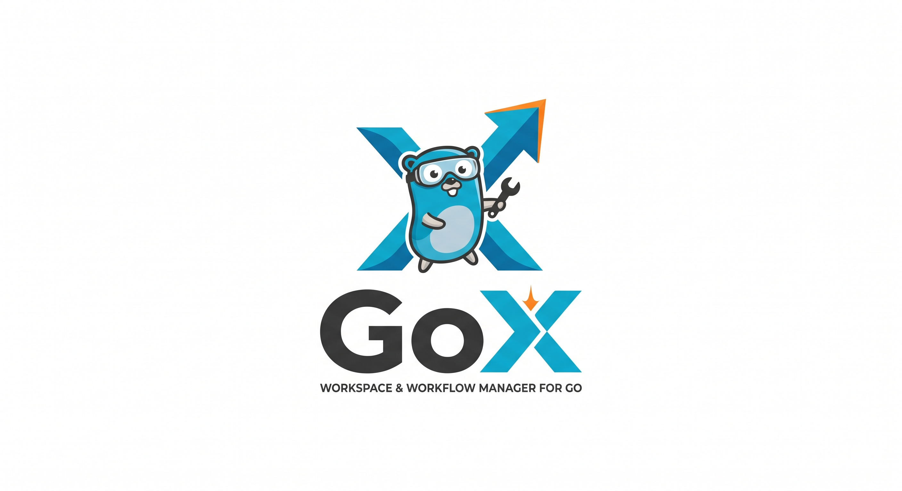

<div align="center">
  
  <h1>🚀 gox</h1>
  <p><b>The All-in-One Workflow Manager for Go Monorepos</b></p>
  <p>
    <i>Stop fighting with Makefiles and scripts. Start building.</i>
  </p>
</div>

---

**`gox`** is a workflow operating tool designed specifically for Go projects. It doesn't replace the Go toolchain; it orchestrates it. Whether you are building a single microservice or managing a massive monorepo with dozens of apps and libraries, `gox` makes your development lifecycle clean, predictable, and incredibly fast.

## ✨ Why `gox`?

When a Go project grows beyond `go run main.go`, things get messy. You end up with complex `go.work` setups, chaotic Makefiles, and custom bash scripts to manage multiple processes. 

**`gox` solves this by providing:**
- 📦 **Instant Monorepo Setup:** Scaffolds a scalable Go workspace architecture in seconds.
- ⚡ **Multi-Process Dev Runner:** Run your API, Worker, and CLI simultaneously with beautifully color-coded logs.
- 🏗️ **Smart Scaffolding:** Add new microservices or shared libraries automatically linked to your `go.work`.
- 🩺 **Built-in Doctor:** Automatically detects missing dependencies, broken module links, and port conflicts!
- 🚀 **One-Click Release:** Cross-compiles lean, production-ready binaries for Windows, Mac, and Linux with SHA-256 checksums out of the box.

---

## 🛠️ Installation

```bash
# Clone the repository
git clone https://github.com/your-username/gox.git

# Build the tool
cd gox
go build -o gox ./cmd/gox

# Move it to your PATH (Linux/Mac)
sudo mv gox /usr/local/bin/

# On Windows, move gox.exe to a folder in your System PATH
```

---

## 🚀 Quick Start

### 1. Initialize a new Workspace
Create a brand new system with a standardized, scalable architecture.
```bash
gox init my-system
cd my-system
```
*This creates the `gox.yaml`, initializes `go mod`, `go work`, and creates standard directories (`apps/`, `libs/`, `docs/`, `deployments/`).*

### 2. Scaffold Microservices
Add a new backend API and a background worker:
```bash
gox app add api
gox app add worker
```
Add a shared library:
```bash
gox lib add database
```
*`gox` will generate the boilerplate code, run `go mod init`, and automatically link them in `go.work` and `gox.yaml`.*

### 3. Run Everything in Dev Mode
Start all your services at once. No more opening 5 different terminal tabs!
```bash
gox dev
```
*(Enjoy the color-coded output, graceful shutdown, and unified logging)*

---

## 📚 Command Reference

| Command | Description |
| :--- | :--- |
| `gox init [name]` | Initialize a new gox workspace and project tree structure. |
| `gox app add <name>` | Generate a new application inside `apps/` and link it. |
| `gox lib add <name>` | Generate a new library inside `libs/` and link it. |
| `gox dev` | Start all applications defined in the `tasks.dev` block of `gox.yaml`. |
| `gox build [app]` | Compile all apps (or a specific app) and place binaries in `bin/`. |
| `gox test [module]` | Run `go test ./...` recursively across all workspace apps and libs. |
| `gox doctor` | Run diagnostics to find port conflicts, missing directories, and environment issues. |
| `gox release [version]`| Cross-compile optimized production binaries (Windows, Linux, macOS) to `dist/` with checksums. |

---

## ⚙️ Configuration (`gox.yaml`)

Your entire ecosystem is orchestrated by a single `gox.yaml` file at the root of your project:

```yaml
name: my-system

apps:
  api:
    path: apps/api
    main: ./cmd/api
    port: 8080
  worker:
    path: apps/worker
    main: ./cmd/worker

libs:
  database:
    path: libs/database

tasks:
  dev:
    - run: api
    - run: worker

release:
  targets:
    - windows/amd64
    - linux/amd64
    - darwin/arm64
```

---

## 🩺 The Doctor is IN

Tired of weird errors because someone forgot to add a folder or two apps are fighting for port `8080`? Just ask the doctor:
```bash
$ gox doctor
--- Gox Doctor ---
✅ Go installed: go version go1.22.0
✅ App 'api' directory exists
❌ Port conflict: App 'worker' and 'api' both use port 8080
⚠️ Found 1 issue(s) that need your attention.
```

---

## 🤝 Philosophy

`gox` is **not** a package manager or a Go replacement. The Go official toolchain is incredibly powerful. `gox` simply acts as the missing workflow operating layer.

**`go command` = Engine** <br/>
**`gox` = Steering Wheel**

---

<div align="center">
  <i>Built for Gophers who love shipping fast.</i>
</div>
